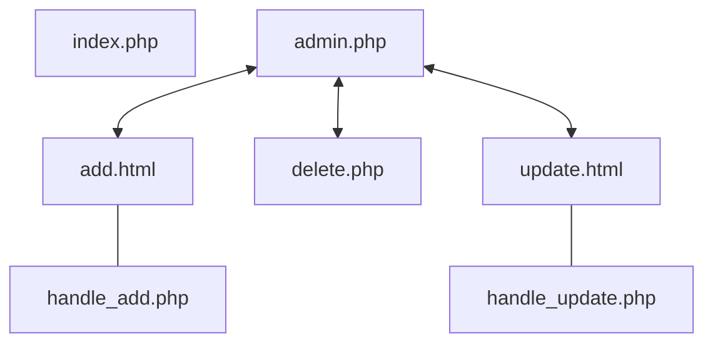

# 目錄
- [介面流程](https://github.com/Qiu25/JobBoard/tree/main#%E4%BB%8B%E9%9D%A2%E6%B5%81%E7%A8%8B)
- [2023/11/30 程式碼紀錄](https://github.com/Qiu25/JobBoard/tree/main#20231130-%E7%A8%8B%E5%BC%8F%E7%A2%BC%E7%B4%80%E9%8C%84)
- [2023/12/04 更新 “排序功能”](https://github.com/Qiu25/JobBoard/tree/main#20231204-%E6%9B%B4%E6%96%B0-%E6%8E%92%E5%BA%8F%E5%8A%9F%E8%83%BD)
- [2023/12/23 登入介面架構](https://github.com/Qiu25/JobBoard/tree/main#20231223-%E7%99%BB%E5%85%A5%E4%BB%8B%E9%9D%A2%E6%9E%B6%E6%A7%8B)
- [2023/12/24 建立登入與註冊入口 | 註冊頁架構優化及排版設置](https://github.com/Qiu25/JobBoard/tree/main#20231224-%E5%BB%BA%E7%AB%8B%E7%99%BB%E5%85%A5%E8%88%87%E8%A8%BB%E5%86%8A%E5%85%A5%E5%8F%A3--%E8%A8%BB%E5%86%8A%E9%A0%81%E6%9E%B6%E6%A7%8B%E5%84%AA%E5%8C%96%E5%8F%8A%E6%8E%92%E7%89%88%E8%A8%AD%E7%BD%AE)
- [2023/12/28 設置會員資料庫 | 將註冊頁與資料庫串接 | 判斷新象是否重複及會員密碼加密](https://github.com/Qiu25/JobBoard/tree/main#20231228)
- [2023/12/29 登入頁架構 | 資料庫簡易串接 | 密碼驗證](https://github.com/Qiu25/JobBoard/tree/main#20231229)
- [2024/01/16 設置會員驗證及權限](https://github.com/Qiu25/JobBoard/tree/main#20240116)
- [2024/03/13 設置會員登出](https://github.com/Qiu25/JobBoard/tree/main#20240313-%E8%A8%AD%E7%BD%AE%E6%9C%83%E5%93%A1%E7%99%BB%E5%87%BA)


# 介面流程



---

# 2023/11/30 程式碼紀錄

## conn.php

```php
<?php
    $servername = 'localhost';
    $username = 'Qiu';
    $password = '1234';
    $dbname = 'database';

    $conn = new mysqli($servername, $username, $password, $dbname);

    if(!empty($conn->connect_error)){
        die('連線錯誤'.$conn->connect_error.'<br>');
    }
    
?>
```

- `conn`
- `new mysqli($servername, $username, $password, $dbname)`

## index.php

```php
<?php
    require_once('./conn.php');
?>
<!DOCTYPE html>
<html lang="en">
<head>
    <meta charset="UTF-8">
    <meta name="viewport" content="width=device-width, initial-scale=1.0">
    <link rel="stylesheet" href="style.css">
    <title>Jobs Board</title>
</head>
<body>
    <div class="container">
        <h1>Jobs Board</h1>
        <div class="job__cards">
            <?php
                $sql = "select * from jobs";
                $result = $conn -> query($sql);
                $today = (new DateTime())->format('Y-m-d');
                if($result){
                    while($row = $result -> fetch_assoc()){
                        if(strtotime($today) < strtotime($row['Expiry'])){
                            echo '<div class="job__card">';    
                            echo    '<div class="job__title">';
                            echo        '<h2>'.$row['Title'].'</h2>';
                            echo    '</div>';
                            echo    '<div class="job__desc">';
                            echo        '<p>'.$row['Description'].'</p>';
                            echo    '</div>';
                            echo    '<div class="job__salary">';
                            echo        '<p>薪資範圍：'.$row['Salary'].'</p>';
                            echo    '</div>';
                            echo    '<div class="job__link">';
                            echo        '<a href="'.$row['Link'].'">更多詳情</a>';
                            echo    '</div>';
                            echo    '<div class="job__created">';
                            echo        '<p>更新日期：'. $row['Created'] . '</p>';
                            echo    '</div>';
                            echo '</div>';
                        }
                    }
                }else{
                    echo $conn->error;
                }
            ?>
        </div>
    </div>
</body>
</html>
```

- `query()`
- `DateTime()`
- `format('Y-m-d')`
- `$row = $result -> fetch_assoc()`
    - `fetch_assoc()`
- `strtotime($today)`

## admin.php

```php
<?php
    require_once('./conn.php');
?>
<!DOCTYPE html>
<html lang="en">
<head>
    <meta charset="UTF-8">
    <meta name="viewport" content="width=device-width, initial-scale=1.0">
    <link rel="stylesheet" href="style.css">
    <title>Jobs Board</title>
</head>
<body>
    <div class="container">
        <h1>Jobs Board 後台管理</h1>
        <a href="./add.html">新增職缺</a>
        <div class="job__cards">
            <?php
                $sql = "select * from jobs";
                $result = $conn -> query($sql);
                if($result){
                    while($row = $result -> fetch_assoc()){
                        echo '<div class="job__card">
                                <div class="job__title">
                                    <h2>'.$row['Title'].'</h2>
                                </div>
                                <div class="job__desc">
                                    <p>'.$row['Description'].'</p>
                                </div>
                                <div class="job__salary">
                                    <p>薪資範圍：'.$row['Salary'].'</p>
                                </div>
                                <div class="job__time">
                                    <p>更新日期：'.$row['Created'].'</p>
                                    <p>更新日期：'.$row['Expiry'].'</p>
                                </div>
                                <div class="job__link">
                                    <a href="delete.php?id='.$row["Id"].'">刪除職缺</a>
                                    <a href="update.php?id='.$row["Id"].'">修改職缺</a>
                                </div>
                              </div>';
                    }
                }else{
                    echo $conn->error;
                }
            ?>
        </div>
    </div>
</body>
</html>
```

## delete.php

```php
<?php
    require('conn.php');
    
    $id = $_GET['id'];
    
    $sql = "DELETE FROM jobs WHERE id = " . $id;

    if($conn->query($sql)){
        echo '刪除成功，即將頁面轉跳';
        die('<meta http-equiv="refresh" content="5; url=./admin.php"> ');
    }else{
        echo 'fail';
    }
?>
```

- `die()`
- `<meta http-equiv="refresh" content="5; url=./admin.php">`

## add.html

```html
<!DOCTYPE html>
<html lang="en">
<head>
    <meta charset="UTF-8">
    <meta name="viewport" content="width=device-width, initial-scale=1.0">
    <link rel="stylesheet" href="style.css">
    <title>Jobs Board 後台管理 - 新增職缺</title>
</head>
<body>
    <div class="container">
        <h1>Jobs Board - 新增職缺</h1>
        <a href="./admin.php">返回後台</a>
        <form method="POST" action="handle_add.php">
            <div>職缺名稱：<input type="text" name="title"></div>
            <div>職缺描述：<textarea rows="10" name="description"></textarea></div>
            <div>薪資範圍：<input type="text" name="salary"></div>
            <div>職缺連結：<input type="link" name="link"></div>
            <input type="submit" value="送出">
        </form>
    </div>
</body>
</html>
```

- `<form method=”POST” action=”handle.php”>`
- `<input type="text" name="title">`

### handle_add.php

```php
<?php
     require('conn.php');

     $title = $_POST['title'];
     $desc = $_POST['description'];
     $salary = $_POST['salary'];
     $link = $_POST['link'];
     $created = (new DateTime())->format('Y-m-d');
     $expiry = ((new DateTime())->modify('+10 days'))->format('Y-m-d');

     if(empty($title)|| empty($desc) || empty($salary) || empty($link)){
        echo '因為您的資料有缺<br>';
        echo '網頁將自動轉跳回上一頁<br>';
        die('<meta http-equiv="refresh" content="5; url=./add.html"> ');
     }

     $sql = "INSERT INTO jobs(Title, Description, Salary, Link, Created, Expiry) 
             VALUES('$title', '$desc', '$salary', '$link', '$created', '$expiry')";
 
     $result = $conn->query($sql);

     if($result){
        echo '新增成功<br>';
        echo '<a href="./add.html">回上一頁</a>';
     }else{
        echo '傳輸失敗'.$conn->error;
     }
?>
```

- `modify('+10 days')`
- `empty($title)`

## update.php

```php
<?php
    require('conn.php');
    $id = $_GET['id'];
    $sql = "SELECT * FROM jobs WHERE id = " . $id;
    $result = $conn->query($sql);
    $row = $result->fetch_assoc();
?>
<!DOCTYPE html>
<html lang="en">
<head>
    <meta charset="UTF-8">
    <meta name="viewport" content="width=device-width, initial-scale=1.0">
    <link rel="stylesheet" href="style.css">
    <title>Jobs Board 後台管理 - 修改職缺</title>
</head>
<body>
    <div class="container">
        <h1>Jobs Board</h1>
        <a href="./admin.html">返回後台</a>
        <form method="POST" action="handle_update.php">
            <div>職缺名稱：<input type="text" name="title" value="<?php echo $row['Title']; ?>"></div>
            <div>職缺描述：<textarea rows="10" name="description"><?php echo $row['Description']; ?></textarea></div>
            <div>薪資範圍：<input type="text" name="salary" value="<?php echo $row['Salary']; ?>"></div>
            <div>職缺連結：<input type="link" name="link" value="<?php echo $row['Link']; ?>"></div>
            <input type="hidden" name="id" value="<?php echo $row['Id'] ?>">
            <input type="submit" value="送出">
        </form>
    </div>
</body>
</html>
```

### handle_update.php

```php
<?php require('conn.php')?>

<?php
    $title = $_POST['title'];
    $desc = $_POST['description'];
    $salary = $_POST['salary'];
    $link = $_POST['link'];
    $id = $_POST['id'];
    $created = (new DateTime())->format('Y-m-d');
    $expiry = ((new DateTime())->modify('+10 days'))->format('Y-m-d');

    $sql = "UPDATE jobs SET Title = '$title', 
            Description = '$desc', 
            Salary = '$salary',
            Link = '$link',
            Created = '$created',
            Expiry = '$expiry'
            WHERE id = '$id' ";

    if($conn->query($sql)){
        echo "修改成功，即將轉跳。";
        die('<meta http-equiv="refresh" content="5; url=./admin.php"> ');
    }else{
        echo "fail" . $conn->error;
    }
?>
```

# 2023/12/04 更新 “排序功能”

### index.php

```php
<?php
    require_once('./conn.php');
    if($_GET){
        $order = $_GET["order"];
        $sort = $_GET["sort"];
        $sql = "SELECT * from jobs ORDER BY $order $sort";
    }else{
        $sql = "SELECT * from jobs";
    }
    
?>
<!DOCTYPE html>
<html lang="en">
<head>
    <meta charset="UTF-8">
    <meta name="viewport" content="width=device-width, initial-scale=1.0">
    <link rel="stylesheet" href="http://localhost/JobBoard/style.css">
    <title>Jobs Board</title>
</head>
<body>
    <div class="container">
        <h1>Jobs Board</h1>
        <div class="order">
            <h3>Order By : </h2>
            <?php
            if($_GET){
                if($sort !== "ASC" && $order == "title"){
                    echo '<a class="sort_asc" href="index.php?order=title&sort=ASC">Title</a>';
                }else{
                    echo '<a class="sort_desc" href="index.php?order=title&sort=DESC">Title</a>';
                }
                if($sort !== "ASC" && $order == "salary"){
                    echo '<a class="sort_asc" href="index.php?order=salary&sort=ASC">Salary</a>';
                }else{
                    echo '<a class="sort_desc" href="index.php?order=salary&sort=DESC">Salary</a>';
                }
                if($sort !== "ASC" && $order == "created"){
                    echo '<a class="sort_asc" href="index.php?order=created&sort=ASC">CreatTime</a>';
                }else{
                    echo '<a class="sort_desc" href="index.php?order=created&sort=DESC">CreatTime</a>';
                }
            }else{
                echo '<a class="sort_asc" href="index.php?order=title&sort=ASC">Title</a>'; 
                echo '<a class="sort_asc" href="index.php?order=salary&sort=ASC">Salary</a>';
                echo '<a class="sort_asc" href="index.php?order=created&sort=ASC">CreatTime</a>';
            }

            ?>
        </div>
        <div class="job__cards">
            <?php
                $result = $conn -> query($sql);
                $today = (new DateTime())->format('Y-m-d');
                if($result){
                    while($row = $result -> fetch_assoc()){
                        if(strtotime($today) < strtotime($row['Expiry'])){
                            echo '<div class="job__card">';    
                            echo    '<div class="job__title">';
                            echo        '<h2>'.$row['Title'].'</h2>';
                            echo    '</div>';
                            echo    '<div class="job__desc">';
                            echo        '<p>'.$row['Description'].'</p>';
                            echo    '</div>';
                            echo    '<div class="job__salary">';
                            echo        '<p>薪資範圍：'.$row['Salary'].'</p>';
                            echo    '</div>';
                            echo    '<div class="job__link">';
                            echo        '<a href="'.$row['Link'].'">更多詳情</a>';
                            echo    '</div>';
                            echo    '<div class="job__created">';
                            echo        '<p>更新日期：'. $row['Created'] . '</p>';
                            echo    '</div>';
                            echo '</div>';
                        }
                    }
                }else{
                    echo $conn->error;
                }
            ?>
        </div>
    </div>
</body>
</html>
```

### style.css

```css
.container{
  width: 100%;
  text-align: center;
  }

.job__card{
  border: 1px solid black;
  width: 1000px;
  margin:  30px auto;
  padding: 10px 20px;
  text-align: left;
}
form{
  margin: 30px;
}
form div{
  margin: 10px;
}

a{
  margin: 20px;
  position: relative;
}

.sort_asc:after{
  content: '';
  position: absolute;
  top: 2px;
  right: -20px;
  border-top: 13px solid black;
  border-right: 8px solid white;
  border-left: 8px solid white;
}

.sort_desc:after{
  content: '';
  position: absolute;
  top: 2px;
  right: -20px;
  border-bottom: 13px solid black;
  border-right: 8px solid white;
  border-left: 8px solid white;
}
```

# 2023/12/23 登入介面架構

### signup.html

```html
<!DOCTYPE html>
<html lang="en">
<head>
  <meta charset="UTF-8">
  <meta name="viewport" content="width=device-width, initial-scale=1.0">
  <title>job Board | Sign Up </title>
</head>
<body>
  <h1>Job Board</h1>
  <h1>Sign Up</h1>
  <form action="">
    <div>
      <label for="email">email</label>
      <input type="email" name="" id="email">
    </div>
    <div>
      <label for="password">password</label>
      <input type="password" name="" id="password">
    </div>
    <div>
      <label for="name">name</label>
      <input type="text" name="" id="name">
    </div>
    <div>
      <label for="telephone">telephone</label>           <!-- 姓名 -->
      <input type="number" name="" id="telephone">    <!-- 電話 -->
    </div>
    <input type="submit" value="送出">
  </form>
</body>
</html>
```

# 2023/12/24 建立登入與註冊入口 | 註冊頁架構優化及排版設置

### index.html

```php
<?php
    require_once('./conn.php');
    if($_GET){
        $order = $_GET["order"];
        $sort = $_GET["sort"];
        $sql = "SELECT * from jobs ORDER BY $order $sort";
    }else{
        $sql = "SELECT * from jobs";
    }
    
?>
<!DOCTYPE html>
<html lang="en">
<head>
    <meta charset="UTF-8">
    <meta name="viewport" content="width=device-width, initial-scale=1.0">
    <link rel="stylesheet" href="./style.css">
    <title>Jobs Board</title>
</head>
<body>
    <div class="container">
        <div class="nav">
                <a href="./signup.html">Sign Up</a>
                <a href="./login.html">Log In</a>
        </div>
        <h1>Jobs Board</h1>
        <div class="order">
            <h3>Order By : </h2>
            <?php
            if($_GET){
                if($sort !== "ASC" && $order == "title"){
                    echo '<a class="sort_asc" href="index.php?order=title&sort=ASC">Title</a>';
                }else{
                    echo '<a class="sort_desc" href="index.php?order=title&sort=DESC">Title</a>';
                }
                if($sort !== "ASC" && $order == "salary"){
                    echo '<a class="sort_asc" href="index.php?order=salary&sort=ASC">Salary</a>';
                }else{
                    echo '<a class="sort_desc" href="index.php?order=salary&sort=DESC">Salary</a>';
                }
                if($sort !== "ASC" && $order == "created"){
                    echo '<a class="sort_asc" href="index.php?order=created&sort=ASC">CreatTime</a>';
                }else{
                    echo '<a class="sort_desc" href="index.php?order=created&sort=DESC">CreatTime</a>';
                }
            }else{
                echo '<a class="sort_asc" href="index.php?order=title&sort=ASC">Title</a>'; 
                echo '<a class="sort_asc" href="index.php?order=salary&sort=ASC">Salary</a>';
                echo '<a class="sort_asc" href="index.php?order=created&sort=ASC">CreatTime</a>';
            }

            ?>
        </div>
        <div class="job__cards">
            <?php
                $result = $conn -> query($sql);
                $today = (new DateTime())->format('Y-m-d');
                if($result){
                    while($row = $result -> fetch_assoc()){
                        if(strtotime($today) < strtotime($row['Expiry'])){
                            echo '<div class="job__card">';    
                            echo    '<div class="job__title">';
                            echo        '<h2>'.$row['Title'].'</h2>';
                            echo    '</div>';
                            echo    '<div class="job__desc">';
                            echo        '<p>'.$row['Description'].'</p>';
                            echo    '</div>';
                            echo    '<div class="job__salary">';
                            echo        '<p>薪資範圍：'.$row['Salary'].'</p>';
                            echo    '</div>';
                            echo    '<div class="job__link">';
                            echo        '<a href="'.$row['Link'].'">更多詳情</a>';
                            echo    '</div>';
                            echo    '<div class="job__created">';
                            echo        '<p>更新日期：'. $row['Created'] . '</p>';
                            echo    '</div>';
                            echo '</div>';
                        }
                    }
                }else{
                    echo $conn->error;
                }
            ?>
        </div>
    </div>
</body>
</html>
```

### signup.html

```html
<!DOCTYPE html>
<html lang="en">
<head>
  <meta charset="UTF-8">
  <meta name="viewport" content="width=device-width, initial-scale=1.0">
  <title>job Board | Sign Up </title>
  <link rel="stylesheet" href="signup_style.css">
</head>
<body>
  <div class="container">
    <h1>Job Board</h1>
    <h2>Sign Up</h2>
    <form action="">
        <label for="email">Email</label>
        <br>
        <input type="email" name="email" id="email">
        <br>
        <label for="password">Password</label>
        <br>
        <input type="password" name="password" id="password">
        <br>
        <label for="name">Name</label>
        <br>
        <input type="text" name="name" id="name">
        <br>
        <label for="telephone">Telephone</label>
        <br>
        <input type="tel" name="telephone" id="telephone" pattern="[0-9]{2}-[0-9]{4}-[0-9]{4}">
        <br>
      <input type="submit" value="送出">
    </form>
  </div>
</body>
</html>
```

### signup_style.css

```css
.container{
  width: 100%;
  text-align: center;
  }
.nav{
  display: flex;
  align-items: center;
  justify-content: flex-end;
}
.nav a{
  font-size: 16px;
  text-decoration: none;
  padding: 5px;
  color: black;
  background-color: white;
  border: 1px solid black;
  margin: -1px;
}

.nav a:hover{
  background-color: black;
  color: white;
}
.job__card{
  border: 1px solid black;
  width: 1000px;
  margin:  30px auto;
  padding: 10px 20px;
  text-align: left;
}
form{
  margin: 30px;
}
form div{
  margin: 10px;
}

.order a{
  margin: 20px;
  position: relative;
}

.sort_asc:after{
  content: '';
  position: absolute;
  top: 2px;
  right: -20px;
  border-top: 13px solid black;
  border-right: 8px solid white;
  border-left: 8px solid white;
}

.sort_desc:after{
  content: '';
  position: absolute;
  top: 2px;
  right: -20px;
  border-bottom: 13px solid black;
  border-right: 8px solid white;
  border-left: 8px solid white;
}
```

# 2023/12/28

## 設置會員資料庫 | 將註冊頁與資料庫串接 | 判斷新象是否重複及會員密碼加密

### 資料庫結構


### signup.html

```html
<!DOCTYPE html>
<html lang="en">
<head>
  <meta charset="UTF-8">
  <meta name="viewport" content="width=device-width, initial-scale=1.0">
  <title>Job Board | Sign Up </title>
  <link rel="stylesheet" href="signup_style.css">
</head>
<body>
  <div class="container">
    <h1>Job Board</h1>
    <h2>Sign Up</h2>
    <form method="POST" action="signup.php">
        <label for="email">Email</label>
        <br>
        <input type="email" name="email" id="email">
        <br>
        <label for="password">Password</label>
        <br>
        <input type="password" name="password" id="password">
        <br>
        <label for="name">Name</label>
        <br>
        <input type="text" name="name" id="name">
        <br>
        <label for="telephone">Telephone</label>
        <br>
        <input type="tel" name="telephone" id="telephone" pattern="[0-9]{2}-[0-9]{4}-[0-9]{4}">
        <br>
      <input type="submit" value="註冊">
    </form>
  </div>
</body>
</html>
```

### sign.php

```php
<?php
  require('conn.php');

  $email = $_POST['email'];
  $password = password_hash($_POST['password'], PASSWORD_DEFAULT);
  $name = $_POST['name'];
  $telphone = $_POST['telephone'];
  
  if(!$email || !$password || !$name || !$telphone){
    echo '因為您的資料有缺<br>';
    echo '網頁將自動轉跳回上一頁，請重新填寫<br>';
    die('<meta http-equiv="refresh" content="5; url=signup.html"> ');
  }

  $sql = "SELECT * FROM user WHERE `Email` = '$email'";

  $result = $conn->query($sql);
  $row = $result -> fetch_assoc();
  
  if($row > 0){
    echo "這個信箱已經註冊過了。";
    echo '網頁將自動轉跳回上一頁，請重新填寫<br>';
    die('<meta http-equiv="refresh" content="5; url=signup.html"> ');
  }else{
    $sql = "INSERT INTO user(Email, Password, Name, Telephone)
          VALUES('$email', '$password', '$name', '$telphone')";

    $result = $conn->query($sql);

    if($result){
      echo '註冊成功';
      echo '頁面即將轉跳。';
      die('<meta http-equiv="refresh" content="5; url=login.html">');
    }else{
      echo $conn->error;
    }
  }
?>
```

# 2023/12/29

## 登入頁架構 | 資料庫簡易串接 | 密碼驗證

### login.html

```html
<!DOCTYPE html>
<html lang="en">
<head>
  <meta charset="UTF-8">
  <meta name="viewport" content="width=device-width, initial-scale=1.0">
  <title>Job Board | Log In </title>
  <link rel="stylesheet" href="signup_style.css">
</head>
<body>
  <div class="container">
    <h1>Job Board</h1>
    <h2>Log In</h2>
    <form method="POST" action="login.php">
        <label for="email">Email</label>
        <br>
        <input type="email" name="email" id="email">
        <br>
        <label for="password">Password</label>
        <br>
        <input type="password" name="password" id="password">
        <br>
      <input type="submit" value="登入">
    </form>
    <a href="./signup.html"></a>
  </div>
</body>
</html>
```

### login.php

```php
<?php
  require('conn.php');

  $email = $_POST['email'];
  $password = $_POST['password'];

  $sql = "SELECT `Email`, `Password` FROM `user` WHERE `Email` = '$email'";
  $result = $conn->query($sql);

  if($result->num_rows > 0){
    $row = $result->fetch_assoc();
    echo password_hash($password, PASSWORD_DEFAULT);
    if(password_verify($password, $row["Password"])){
      echo 'Login Successful!';
    }else{
      echo 'Invalid Password!';
    }
  }else{
    echo 'User Not Found!';
  }

?>
```

# 2024/01/16

## 設置會員驗證及權限

設置未登入及已登入的差異

### index.php

```php
<?php
    require_once('./conn.php');
    if($_GET){
        $order = $_GET["order"];
        $sort = $_GET["sort"];
        $sql = "SELECT * from jobs ORDER BY $order $sort";
    }else{
        $sql = "SELECT * from jobs";
    }
    
?>
<!DOCTYPE html>
<html lang="en">
<head>
    <meta charset="UTF-8">
    <meta name="viewport" content="width=device-width, initial-scale=1.0">
    <link rel="stylesheet" href="./style.css">
    <title>Jobs Board</title>
</head>
<body>
    <div class="container">
        <div class="nav">
            <?php
                // 開啟會話
                session_start();
                // 檢查用戶是否登入
                if(!isset($_SESSION["user_id"])){
                    echo "<a href='./signup.html'>Sign Up</a>
                          <a href='./login.html'>Log In</a>";
                }else{
                    echo "Welcome, " . $_SESSION["user_id"];
                }
            ?>
        </div>
        <h1>Jobs Board</h1>
        <div class="order">
            <h3>Order By : </h2>
            <?php
            if($_GET){
                if($sort !== "ASC" && $order == "title"){
                    echo '<a class="sort_asc" href="index.php?order=title&sort=ASC">Title</a>';
                }else{
                    echo '<a class="sort_desc" href="index.php?order=title&sort=DESC">Title</a>';
                }
                if($sort !== "ASC" && $order == "salary"){
                    echo '<a class="sort_asc" href="index.php?order=salary&sort=ASC">Salary</a>';
                }else{
                    echo '<a class="sort_desc" href="index.php?order=salary&sort=DESC">Salary</a>';
                }
                if($sort !== "ASC" && $order == "created"){
                    echo '<a class="sort_asc" href="index.php?order=created&sort=ASC">CreatTime</a>';
                }else{
                    echo '<a class="sort_desc" href="index.php?order=created&sort=DESC">CreatTime</a>';
                }
            }else{
                echo '<a class="sort_asc" href="index.php?order=title&sort=ASC">Title</a>'; 
                echo '<a class="sort_asc" href="index.php?order=salary&sort=ASC">Salary</a>';
                echo '<a class="sort_asc" href="index.php?order=created&sort=ASC">CreatTime</a>';
            }

            ?>
        </div>
        <div class="job__cards">
            <?php
                $result = $conn -> query($sql);
                $today = (new DateTime())->format('Y-m-d');
                if($result){
                    while($row = $result -> fetch_assoc()){
                        if(strtotime($today) < strtotime($row['Expiry'])){
                            echo '<div class="job__card">';    
                            echo    '<div class="job__title">';
                            echo        '<h2>'.$row['Title'].'</h2>';
                            echo    '</div>';
                            echo    '<div class="job__desc">';
                            echo        '<p>'.$row['Description'].'</p>';
                            echo    '</div>';
                            echo    '<div class="job__salary">';
                            echo        '<p>薪資範圍：'.$row['Salary'].'</p>';
                            echo    '</div>';
                            echo    '<div class="job__link">';
                            echo        '<a href="'.$row['Link'].'">更多詳情</a>';
                            echo    '</div>';
                            echo    '<div class="job__created">';
                            echo        '<p>更新日期：'. $row['Created'] . '</p>';
                            echo    '</div>';
                            echo '</div>';
                        }
                    }
                }else{
                    echo $conn->error;
                }
            ?>
        </div>
    </div>
</body>
</html>
```

### login.html

```php
<!DOCTYPE html>
<html lang="en">
<head>
  <meta charset="UTF-8">
  <meta name="viewport" content="width=device-width, initial-scale=1.0">
  <title>Job Board | Log In </title>
  <link rel="stylesheet" href="signup_style.css">
</head>
<body>
  <div class="container">
    <h1>Job Board</h1>
    <h2>Log In</h2>
    <form method="POST" action="login.php">
        <label for="email">Email</label>
        <br>
        <input type="email" name="email" id="email">
        <br>
        <label for="password">Password</label>
        <br>
        <input type="password" name="password" id="password">
        <br>
      <input type="submit" name="login" value="登入">
    </form>
  </div>
</body>
</html>
```

### login.php

```php
<?php
  require('conn.php');

// $_SERVER['REQUEST_METHOD'] & isset() 
if($_SERVER['REQUEST_METHOD'] == 'POST' && isset($_POST['login'])){

  $email = $_POST['email'];
  $password = $_POST['password'];
  
  // 驗證是否輸入正確
  if(!$email || !$password){
    die('請輸入信箱或密碼。');
  }
  
  // 查詢資料庫驗證Email是否存在
  $sql = "SELECT `Email`, `Password` FROM `user` WHERE `Email` = '$email'";
  $result = $conn->query($sql);

  // 驗證密碼
  if($result->num_rows > 0){
    $row = $result->fetch_assoc();
    // 驗證成功
    if(password_verify($password, $row["Password"])){
      // session_start();
      // 驗證成功則開啟會話，並設置會話變量
      session_start();
      $_SESSION["user_id"] = $row["Email"];
      
      echo 'Login Successful!';
      die('<meta http-equiv="refresh" content="5; url=index.php">');
    }else{
      echo 'Invalid Password!';
    }
  }else{
    echo 'User Not Found!';
  }
}
  
?>
```

# 2024/03/13 設置會員登出

## index.html

```php
<?php
    require_once('./conn.php');
    if($_GET){
        $order = $_GET["order"];
        $sort = $_GET["sort"];
        $sql = "SELECT * from jobs ORDER BY $order $sort";
    }else{
        $sql = "SELECT * from jobs";
    }
    
?>
<!DOCTYPE html>
<html lang="en">
<head>
    <meta charset="UTF-8">
    <meta name="viewport" content="width=device-width, initial-scale=1.0">
    <link rel="stylesheet" href="./style.css">
    <title>Jobs Board</title>
</head>
<body>
    <div class="container">
        <div class="nav">
            <?php
                // 開啟會話
                session_start();
                // 檢查用戶是否登入
                if(!isset($_SESSION["user_id"])){
                    echo "<a href='./signup.html'>Sign Up</a>
                          <a href='./login.html'>Log In</a>";
                }else{
                    echo "<p>Welcome, " . $_SESSION["user_id"] . "</p>";
                    echo "<a href='./logout.php'>Log Out</a>";
                }
            ?>
        </div>
        <h1>Jobs Board</h1>
        <div class="order">
            <h3>Order By : </h2>
            <?php
            if($_GET){
                if($sort !== "ASC" && $order == "title"){
                    echo '<a class="sort_asc" href="index.php?order=title&sort=ASC">Title</a>';
                }else{
                    echo '<a class="sort_desc" href="index.php?order=title&sort=DESC">Title</a>';
                }
                if($sort !== "ASC" && $order == "salary"){
                    echo '<a class="sort_asc" href="index.php?order=salary&sort=ASC">Salary</a>';
                }else{
                    echo '<a class="sort_desc" href="index.php?order=salary&sort=DESC">Salary</a>';
                }
                if($sort !== "ASC" && $order == "created"){
                    echo '<a class="sort_asc" href="index.php?order=created&sort=ASC">CreatTime</a>';
                }else{
                    echo '<a class="sort_desc" href="index.php?order=created&sort=DESC">CreatTime</a>';
                }
            }else{
                echo '<a class="sort_asc" href="index.php?order=title&sort=ASC">Title</a>'; 
                echo '<a class="sort_asc" href="index.php?order=salary&sort=ASC">Salary</a>';
                echo '<a class="sort_asc" href="index.php?order=created&sort=ASC">CreatTime</a>';
            }

            ?>
        </div>
        <div class="job__cards">
            <?php
                $result = $conn -> query($sql);
                $today = (new DateTime())->format('Y-m-d');
                if($result){
                    while($row = $result -> fetch_assoc()){
                        if(strtotime($today) < strtotime($row['Expiry'])){
                            echo '<div class="job__card">';    
                            echo    '<div class="job__title">';
                            echo        '<h2>'.$row['Title'].'</h2>';
                            echo    '</div>';
                            echo    '<div class="job__desc">';
                            echo        '<p>'.$row['Description'].'</p>';
                            echo    '</div>';
                            echo    '<div class="job__salary">';
                            echo        '<p>薪資範圍：'.$row['Salary'].'</p>';
                            echo    '</div>';
                            echo    '<div class="job__link">';
                            echo        '<a href="'.$row['Link'].'">更多詳情</a>';
                            echo    '</div>';
                            echo    '<div class="job__created">';
                            echo        '<p>更新日期：'. $row['Created'] . '</p>';
                            echo    '</div>';
                            echo '</div>';
                        }
                    }
                }else{
                    echo $conn->error;
                }
            ?>
        </div>
    </div>
</body>
</html>
```

## logout.php

```php
<?php
  require('conn.php');

  session_start();

  session_destroy();

  echo "登出成功，即將轉跳";
  die('<meta http-equiv="refresh" content="5; url=index.php">');
?>
```

# 2024/03/14 使用cookie代替sessiob進行登入狀態維持

## index.html

```php
<?php
    require_once('./conn.php');
    if($_GET){
        $order = $_GET["order"];
        $sort = $_GET["sort"];
        $sql = "SELECT * from jobs ORDER BY $order $sort";
    }else{
        $sql = "SELECT * from jobs";
    }
    
?>
<!DOCTYPE html>
<html lang="en">
<head>
    <meta charset="UTF-8">
    <meta name="viewport" content="width=device-width, initial-scale=1.0">
    <link rel="stylesheet" href="./style.css">
    <title>Jobs Board</title>
</head>
<body>
    <div class="container">
        <div class="nav">
            <?php
                // 檢查用戶是否登入
                if(!isset($_COOKIE["user_id"])){
                    echo "<a href='./signup.html'>Sign Up</a>
                          <a href='./login.html'>Log In</a>";
                }else{
                    echo "<p>Welcome, " . $_COOKIE["user_id"] . "</p>";
                    echo "<a href='./logout.php'>Log Out</a>";
                }
            ?>
        </div>
        <h1>Jobs Board</h1>
        <div class="order">
            <h3>Order By : </h2>
            <?php
            if($_GET){
                if($sort !== "ASC" && $order == "title"){
                    echo '<a class="sort_asc" href="index.php?order=title&sort=ASC">Title</a>';
                }else{
                    echo '<a class="sort_desc" href="index.php?order=title&sort=DESC">Title</a>';
                }
                if($sort !== "ASC" && $order == "salary"){
                    echo '<a class="sort_asc" href="index.php?order=salary&sort=ASC">Salary</a>';
                }else{
                    echo '<a class="sort_desc" href="index.php?order=salary&sort=DESC">Salary</a>';
                }
                if($sort !== "ASC" && $order == "created"){
                    echo '<a class="sort_asc" href="index.php?order=created&sort=ASC">CreatTime</a>';
                }else{
                    echo '<a class="sort_desc" href="index.php?order=created&sort=DESC">CreatTime</a>';
                }
            }else{
                echo '<a class="sort_asc" href="index.php?order=title&sort=ASC">Title</a>'; 
                echo '<a class="sort_asc" href="index.php?order=salary&sort=ASC">Salary</a>';
                echo '<a class="sort_asc" href="index.php?order=created&sort=ASC">CreatTime</a>';
            }

            ?>
        </div>
        <div class="job__cards">
            <?php
                $result = $conn -> query($sql);
                $today = (new DateTime())->format('Y-m-d');
                if($result){
                    while($row = $result -> fetch_assoc()){
                        if(strtotime($today) < strtotime($row['Expiry'])){
                            echo '<div class="job__card">';    
                            echo    '<div class="job__title">';
                            echo        '<h2>'.$row['Title'].'</h2>';
                            echo    '</div>';
                            echo    '<div class="job__desc">';
                            echo        '<p>'.$row['Description'].'</p>';
                            echo    '</div>';
                            echo    '<div class="job__salary">';
                            echo        '<p>薪資範圍：'.$row['Salary'].'</p>';
                            echo    '</div>';
                            echo    '<div class="job__link">';
                            echo        '<a href="'.$row['Link'].'">更多詳情</a>';
                            echo    '</div>';
                            echo    '<div class="job__created">';
                            echo        '<p>更新日期：'. $row['Created'] . '</p>';
                            echo    '</div>';
                            echo '</div>';
                        }
                    }
                }else{
                    echo $conn->error;
                }
            ?>
        </div>
    </div>
</body>
</html>
```

## login.php
```php
<?php
  require('conn.php');

// $_SERVER['REQUEST_METHOD'] & isset() 
if($_SERVER['REQUEST_METHOD'] == 'POST' && isset($_POST['login'])){

  $email = $_POST['email'];
  $password = $_POST['password'];
  
  // 驗證是否輸入正確
  if(!$email || !$password){
    die('請輸入信箱或密碼。');
  }
  
  // 查詢資料庫驗證Email是否存在
  $sql = "SELECT `Email`, `Password` FROM `user` WHERE `Email` = '$email'";
  $result = $conn->query($sql);

  // 驗證密碼
  if($result->num_rows > 0){
    $row = $result->fetch_assoc();
    // 驗證成功
    if(password_verify($password, $row["Password"])){
      // 設定Cookie
      setcookie("user_id", $row["Email"], time()+600);
      
      // echo $_COOKIE["user_id"];

      echo "Login Seccessfull";
      die('<meta http-equiv="refresh" content="5; url=index.php">');
    }else{
      echo 'Invalid Password!';
    }
  }else{
    echo 'User Not Found!';
  }
}
  
?>
```
